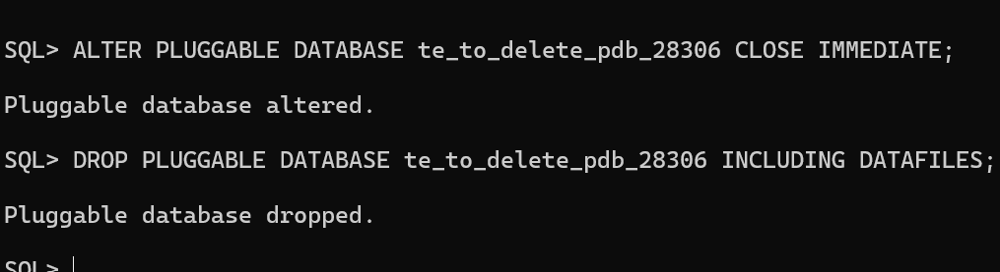
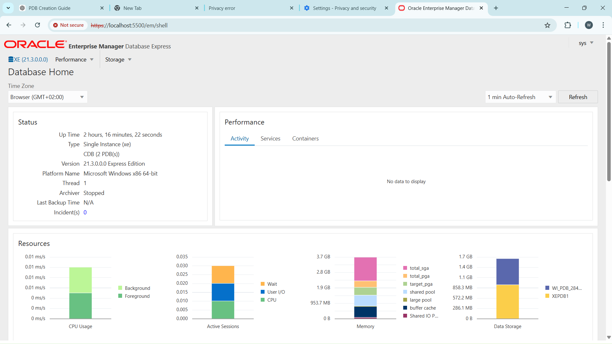

# oracle_pdb_ass_II_28306_teddy

# Oracle Pluggable Database Assignment II

## Student Information

Name: Mariza Teddy  
Student ID: 28306

---

## Oracle Environment used;

- Oracle Database 21c
- Operating System: Windows
- Tools Used: SQL\*Plus, Oracle SQL Developer

---

## PDB Creation

- Created Pluggable Database: `te_pdb_28306`

- Created User inside PDB: `teddy_plsqlauca_28306`

- User granted CONNECT and RESOURCE privileges

---

## Temporary PDB

- Temporary PDB created: `te_to_delete_pdb_28306`
  
- Verified existence
  
- Deleted completely including datafiles
- Confirmed removal
  

---

## Oracle Enterprise Manager / Environment Verification

Oracle Enterprise Manager Express couldn't be accessed due to local listener and HTTPS connection issues.

Oracle SQL Developer was used as an alternative administrative interface to verify:

- Oracle environment
- Created PDB
- Created user

---

## Challenges Faced

Oracle Listener service failed to remain active which prevented access to Oracle Enterprise Manager Express.  
This was resolved by using Oracle SQL Developer as an alternative tool to verify PDBs and users.

## FINAL CHECKLIST

- [✔️] Correct PDB names used
- [✔️] User created inside the PDB
- [✔️] Temporary PDB created and deleted
- [✔️] OEM dashboard screenshot included
- [✔️] GitHub repository is PUBLIC
- [✔️] README is clear and professional
- [✔️] Deadline respected

---

## References

- Oracle Corporation. Oracle Database Documentation (21c).  
  https://docs.oracle.com/en/database/oracle/oracle-database/21/

- Oracle Corporation. Multitenant Architecture (Pluggable Databases).  
  https://docs.oracle.com/en/database/oracle/oracle-database/21/multi/

- Oracle Corporation. SQL\*Plus Command-Line Tool.  
  https://docs.oracle.com/en/database/oracle/oracle-database/21/sqpug/

- GitHub Docs – Getting Started with Repositories.  
  https://docs.github.com/en/repositories/creating-and-managing-repositories/creating-a-new-repository
